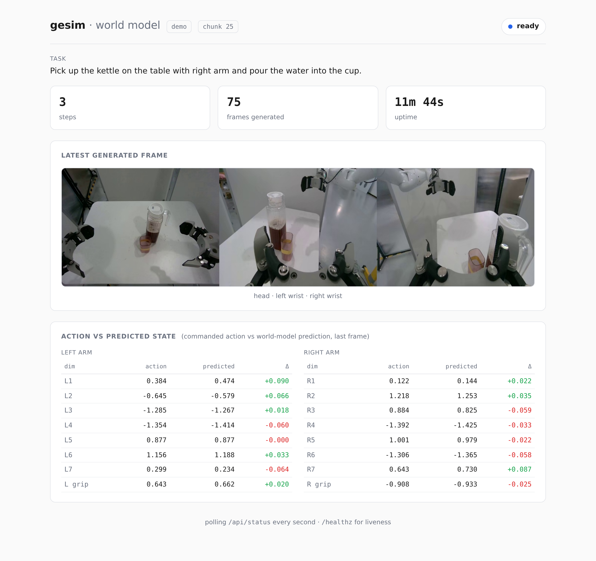
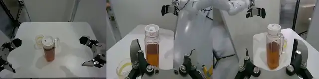
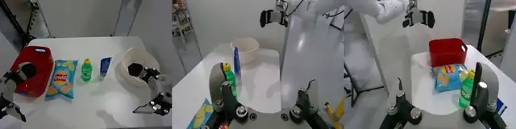

<div align="center">


# GE-Sim 2.0

### A Roadmap Towards Comprehensive Closed-loop Video World Simulators for Robotic Manipulation

<p>
  <a href="https://ge-sim-v2.github.io/"></a>
  <a href="https://arxiv.org/abs/2605.27491"></a>
  <a href="https://github.com/AgibotTech/GE-Sim-V2"></a>
  <a href="https://huggingface.co/agibot-world/Genie-Envisioner-Sim-v2.0"></a>
  <a href="#license"></a>
</p>

</div>

---

<div align="center">
  
  <p><em><b>Overview of GE-Sim 2.0.</b> GE-Sim 2.0 is a closed-loop video world simulator for robotic 
manipulation, trained on millions of real-world episodes spanning 
teleoperation, on-robot policy deployment, and rich object interaction. </em></p>
</div>

> **Released model.** The open-sourced GE-Sim 2.0 weights are trained for the
> **Genie-01 (G01)** dual-arm robot with the **OmniPicker** gripper. Support for
> the **Genie-02 (G02)** robot is on the roadmap.

---

## News

- [2026.06.25] 💻 The [code](https://github.com/AgibotTech/GE-Sim-V2) and [model weights](https://huggingface.co/agibot-world/Genie-Envisioner-Sim-v2.0) of GE-Sim 2.0 have been released.

- [2026.05.28] 📄 The technical report [GE-Sim 2.0: A Roadmap Towards Comprehensive Closed-loop Video World Simulators for Robotic Manipulation](https://arxiv.org/abs/2605.27491) has been released on arXiv.

- [2026.04.10] 🌐 The [project page](https://ge-sim-v2.github.io/) of GE-Sim 2.0 has been released.


## TODO

- [x] Release technical report
- [x] Release code
- [x] Release model weights (Genie-01 / G01)
- [ ] Release Genie-02 / G02 robot support

---


<!-- # GE Sim

GE Sim V2 is an action-conditioned world model for robot manipulation. It takes
a stream of 16-D robot joint actions and generates predicted multi-view video
plus robot state. Use it to replay recorded episodes or to evaluate policies in
a closed loop without a physical robot. Per-frame task rewards are supported via
a pluggable reward client (none bundled).

## Architecture

```
   ┌──────────────────────┐  actions (L,16)   ┌──────────────────────────┐  frames (T,3,V,H,W)   ┌──────────────────────┐
   │  policy               │ ────────────────► │  WorldModelEnv            │ ─────────────────────► │  world-model server   │
   │  (openpi, websocket)  │                   │  (python client)          │      + robot state     │  (gesim_v2, GPU, HTTP)│
   │                       │ ◄──────────────── │  chunking, FK             │ ◄───────────────────── │                       │
   └──────────────────────┘  obs (images,      │  trajectory-band          │   frames + state       └──────────────────────┘
                             state, task)      │  conditioning             │
                                               └────────────┬─────────────┘
                                                            │  head-camera frames + task
                                                            ▼
                                               ┌──────────────────────────┐
                                               │  RewardClient (optional)  │ ── success/progress ──►
                                               │  bring your own           │
                                               └──────────────────────────┘
```

The policy returns `(L, 16)` joint-space action chunks — absolute joint targets
`[L7_arm, L_grip, R7_arm, R_grip]` (7 arm joints + 1 gripper per arm), not
end-effector poses. `WorldModelEnv` splits them into
model-sized chunks, renders the trajectory-band conditioning the model requires
(via forward kinematics in closed loop), and exchanges binary requests with the
world-model server, which returns `(T, 3, V, H, W)` frames and predicted state.
When a `RewardClient` is attached, each step's head-camera frames are scored
against the task to produce per-frame success and progress. -->

## Quickstart

Action conditioning renders the trajectory band from policy actions via forward
kinematics. The Genie-01 (G01) robot kinematics ship as a compiled FK library
inside the package (`gesim/conditioning/_g01_fk.so`) — no robot description
(URDF/geometry) is published — so closed loop runs with no extra setup (see
docs/closed_loop.md).

```python
from gesim import WorldModelEnv
from gesim.policies import OpenPIPolicy

env = WorldModelEnv("http://localhost:9000")
policy = OpenPIPolicy("ws://localhost:8000")
policy.reset()

obs = env.reset("assets/demo_000", conditioning="action")
for _ in range(8):
    actions = policy.infer(obs)
    obs, reward, state, info = env.step(actions)  # state: (T, 16) predicted robot state
env.save_video("rollout.mp4")
```

`reward` is `None` unless you attach a `RewardClient` via
`WorldModelEnv(reward=...)`; no reward model is bundled (see
[docs/adding_rewards.md](docs/adding_rewards.md)).

## Installation

```bash
git clone --recursive <repo-url> gesim
cd gesim

pip install -e ".[server]"   # world-model server (GPU)
# or
pip install -e .             # client only (runs anywhere)

# policy extra: the lightweight openpi websocket client
pip install -e third_party/openpi/packages/openpi-client
```

Running the `gesim_v2` world model needs the released checkpoints. Download them
from [Hugging Face](https://huggingface.co/agibot-world/Genie-Envisioner-Sim-v2.0):

```bash
huggingface-cli download agibot-world/Genie-Envisioner-Sim-v2.0 \
    --include "checkpoints/**" --local-dir .
```

This fetches the world model (`checkpoints/gesim_community_v2.0.1_g01op_distill_2B`)
and the pi05 policy (`checkpoints/pi05_gesim_g01op_test`). Set `checkpoint` in
[`configs/gesim_v2.yaml`](configs/gesim_v2.yaml) to the world-model folder (the
folder is self-contained). See [`docs/installation.md`](docs/installation.md) for
accelerated-kernel builds and checkpoint details.

## Running

Replay a recorded episode (two terminals):

```bash
# terminal 1: world-model server
MODEL=gesim_v2 CONFIG=configs/gesim_v2.yaml bash scripts/serve_world_model.sh

# terminal 2: replay
python examples/replay.py --server http://localhost:9000 \
    --episode assets/demo_000 --output-dir outputs/replay
```

Closed-loop policy rollout (three terminals):

```bash
# terminal 1: world-model server
MODEL=gesim_v2 CONFIG=configs/gesim_v2.yaml bash scripts/serve_world_model.sh

# terminal 2: openpi policy server in its own env (see openpi_serving/README.md)
OPENPI_CKPT=checkpoints/pi05_gesim_g01op_test bash scripts/serve_policy_pi05.sh

# terminal 3: closed-loop rollout (FK conditioning uses the compiled Genie-01 kinematics)
python examples/closed_loop.py --server http://localhost:9000 \
    --policy ws://localhost:8000 --episode assets/demo_000 --steps 8
```

The world-model server also serves a live dashboard at its own address
(`http://localhost:9000`) — open it in a browser to watch the current phase,
step count, the commanded action vs the world-model's predicted robot state, and
a preview of the latest generated frame. To see the dashboard without a real
model or rollout, run `python -m gesim.server --demo` and open the URL.



## Example rollouts

Closed-loop rollouts of a pi05 policy inside the GE Sim world model. Each clip
tiles the three camera views (head, left wrist, right wrist) left-to-right — the
world model generates the video from the policy's actions. A stronger policy
completes the task; a weaker one fails (missed grasp, dropped object).

**Successful task completions:**

|  |  |  |
|:-:|:-:|:-:|
|  |  |  |

**Failures (weaker policy):**

|  |  |  |
|:-:|:-:|:-:|
|  |  |  |

## Repository layout

| Path | Contents |
|---|---|
| `src/gesim` | The `gesim` package: `WorldModelEnv`, policies, rewards, server, models. |
| `configs` | World-model config (`gesim_v2.yaml`) and openpi serving recipe. |
| `examples` | Runnable entry points: `replay.py`, `closed_loop.py`. |
| `scripts` | Thin launchers for the world-model and policy servers. |
| `assets` | 3 demo episode bundles (`demo_000`–`demo_002`) + example rollout clips (`example_output/`). |
| `docs` | Installation, replay, closed-loop, and extension guides. |
| `third_party` | The `openpi` git submodule (policy serving). |
| `tests` | CPU-only pytest suite (codecs, bundle loading, registry, smoke test). |

## Documentation

- [Installation](docs/installation.md)
- [Replay a recorded episode](docs/replay.md)
- [Closed-loop policy rollout](docs/closed_loop.md)
- [Adding a policy](docs/adding_policies.md)
- [Adding a world model](docs/adding_world_models.md)
- [Adding a reward client](docs/adding_rewards.md)
- [Serving pi05 with openpi](configs/openpi/README.md)

## Citation

If you find GE-Sim 2.0 useful for your research, please consider citing:

```
@article{qiu2026gesim2,
  title={GE-Sim 2.0: A Roadmap Towards Comprehensive Closed-loop Video World Simulators for Robotic Manipulation},
  author={Qiu, Boxiang and Chen, Liliang and Liao, Yue and Wang, Nan and Wang, Lintao and Luo, Jiayi and Zhao, Wenzhi and Chen, Shengcong and Chen, Di and Li, Ye and Gao, Chen and Yan, Shuicheng and Liu, Si and Yao, Maoqing and Ren, Guanghui},
  journal={arXiv preprint arXiv:2605.27491},
  year={2026}
}
```


## License

Codes adapted from upstream projects such as [Diffusers](https://github.com/huggingface/diffusers/) and [Cosmos](https://github.com/nvidia-cosmos) are released under [Apache License 2.0](https://github.com/huggingface/diffusers/blob/main/LICENSE).

The pi05 policy is served through [openpi](https://github.com/Physical-Intelligence/openpi) (Physical Intelligence), included as a submodule under `third_party/openpi` and licensed under [Apache License 2.0](https://github.com/Physical-Intelligence/openpi/blob/main/LICENSE). Because pi05 builds on PaliGemma, its use is additionally subject to the [Gemma Terms of Use](https://ai.google.dev/gemma/terms) (see `third_party/openpi/LICENSE_GEMMA.txt`).

Other data and codes within this repo are under [CC BY-NC-SA 4.0](https://creativecommons.org/licenses/by-nc-sa/4.0/).
