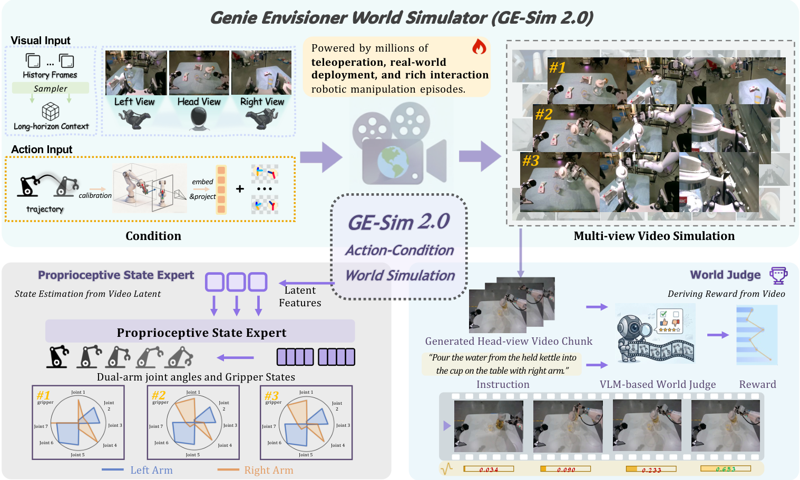

<div align="center">


# GE-Sim 2.0

### A Roadmap Towards Comprehensive Closed-loop Video World Simulators for Robotic Manipulation

<p>
  <a href="https://ge-sim-v2.github.io/"></a>
  <a href="https://arxiv.org/abs/2605.27491"></a>
  <a href="#todo"></a>
  <a href="#todo"></a>
  <a href="#license"></a>
</p>

</div>

---

<div align="center">
  
  <p><em><b>Overview of GE-Sim 2.0.</b> GE-Sim 2.0 is a closed-loop video world simulator for robotic 
manipulation, trained on millions of real-world episodes spanning 
teleoperation, on-robot policy deployment, and rich object interaction. </em></p>
</div>

---

## News

- [2026.05.28] 📄 The technical report [GE-Sim 2.0: A Roadmap Towards Comprehensive Closed-loop Video World Simulators for Robotic Manipulation](https://arxiv.org/abs/2605.27491) has been released on arXiv.

- [2026.04.10] 🌐 The [project page](https://ge-sim-v2.github.io/) of GE-Sim 2.0 has been released.


## TODO

- [x] Release technical report
- [ ] Release code
- [ ] Release model weights
- [ ] Release evaluation toolkit

---

## Citation

If you find GE-Sim 2.0 useful for your research, please consider citing:

```
@article{qiu2026gesim2,
  title={GE-Sim 2.0: A Roadmap Towards Comprehensive Closed-loop Video World Simulators for Robotic Manipulation},
  author={Qiu, Boxiang and Chen, Liliang and Liao, Yue and Wang, Nan and Wang, Lintao and Luo, Jiayi and Zhao, Wenzhi and Chen, Shengcong and Chen, Di and Li, Ye and Gao, Chen and Yan, Shuicheng and Liu, Si and Yao, Maoqing and Ren, Guanghui},
  journal={arXiv preprint arXiv:2605.27491},
  year={2026}
}
```


## License

Codes adapted from upstream projects such as [Diffusers](https://github.com/huggingface/diffusers/) and [Cosmos](https://github.com/nvidia-cosmos) are released under [Apache License 2.0](https://github.com/huggingface/diffusers/blob/main/LICENSE).

Other data and codes within this repo are under [CC BY-NC-SA 4.0](https://creativecommons.org/licenses/by-nc-sa/4.0/).
